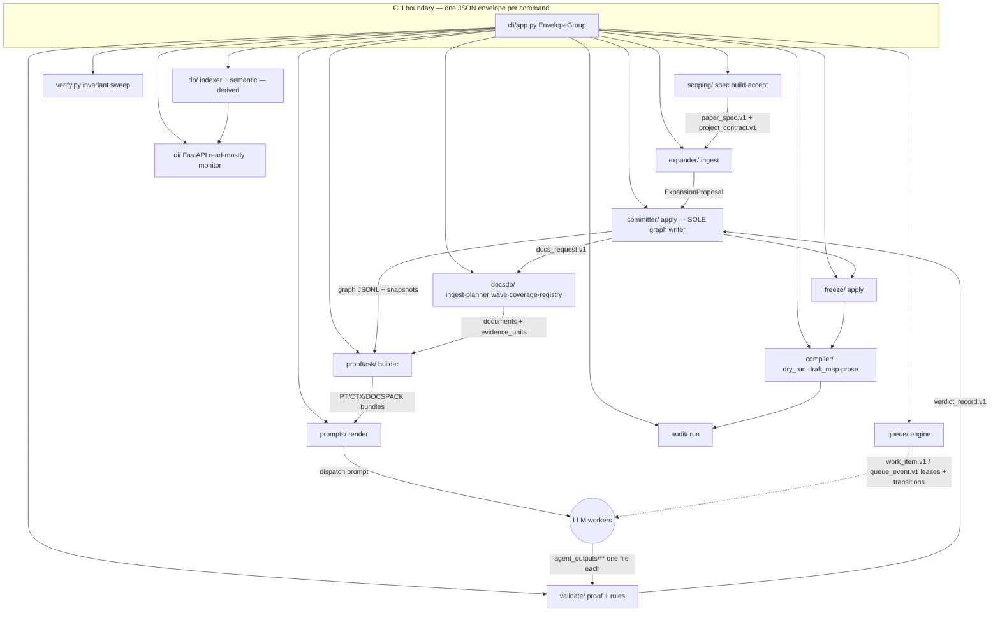

# Architecture — PaperGraph (`paperproof`)

Re-derived from `src/paperproof` code (reorganize-logic rebuild, 2026-07-09).
The code is the source of truth; every claim below carries a code anchor.
Companion artifacts: `structure.md` (module map), `interfaces.md` (gate-checked
public surface, 408 symbols).

## System thesis (as implemented)

PaperGraph builds a research argument as a **Logic Graph** (claims = nodes,
argumentative moves = typed edges) and produces prose only at the very end.
Deterministic Python (`paperproof`) performs **all** bookkeeping, validation and
verdict computation; LLM workers (ProofWorker / DocsWorker / CoverageCritic /
CompileWorker) only fill **closed forms** or produce constrained artifacts, each
written to a single declared file under `agent_outputs/`. Every canonical record
lives in append-only JSONL under `data/projects/<id>/`; every derived store
(DuckDB, semantic vectors, coverage ledger) is rebuildable and never
authoritative.

## Components (owner → responsibility, from code)

- **`scoping/`** — parses the Markdown topic file deterministically (parse.py),
  derives PaperSpec + ProjectContract, applies RFC 7386 merge patches in fixed
  order, runs `v_spec.check` (`scoping/build.py:149`). `spec accept` is the only
  acceptance path; the accepted contract gates all downstream work (V-GATE-01).
- **`graph/`** — read side only: `GraphView` (latest-per-id fold of the graph
  JSONL), spine computation (active ancestor closure of the thesis), 1-hop
  neighborhoods, MSA checklist (`graph/commands.py`), and `trace` (sentence →
  claim → freeze → commit → verdict → EU → Document → raw file).
- **`expander/`** — validates ExpansionProposals (`v_exp.check` at
  `expander/ingest.py:43,72`), enforces the sweep floor V-SWEEP-01 before the
  first beyond-layer-0 expansion (`ingest.py:103`), then hands the proposal to
  the Committer. Never writes graph files itself.
- **`prooftask/`** — builds immutable proof bundles (ProofTask + ContextPack +
  DocsPack) at `-rN` revisions; validates them with `v_task.check_context_pack`
  / `check_docs_pack` / `v_cov.check_context_pack_coverage`
  (`prooftask/builder.py:153-155`) before attaching to queue items.
- **`validate/`** — the maker/checker heart. `validate/proof.py` drives a
  submitted proof artifact through V-PATH (path/JSON/lease-scope) → `v_pr.raw_scan`
  (V-PR-03) → `v_pr.check` (semantics **and** verdict computation via the
  decision table) and appends the `verdict_record.v1` under `proof/.lock`.
  `validate/rules/` is a pure-function rule library returning `list[Failure]`;
  `validate/registry.py` holds the V-* id registry.
- **`committer/`** — the **only** Logic Graph mutator, serial under
  `commit/.lock`. Maps verdicts to actions (pass / needs_repair bridge+narrow /
  needs_docs / rejected+cascade), creates AND wires bridge nodes, appends
  exactly one `commit_decision.v1` per commit, re-runs graph record rules on the
  simulated post-state (`apply.py:463`), and takes the post-commit snapshot.
  `decision_table.py` is a dependency-free pure function shared with the
  Validator; `replay.py` proves V-COMMIT-04 reproducibility.
- **`docsdb/`** — the evidence subsystem: `ingest.py` (sole writer of
  documents/evidence_units/docs_requests + raw/text archives; validates worker
  DocsResults with V-PATH + V-DR + V-SP at `ingest.py:153-178`), `planner.py`
  (deterministic SearchPlan compiler, no LLM), `wave.py` (fan-out wave lifecycle:
  members → deterministic merge → critic → code-computed wave verdict, R_MAX=2),
  `coverage.py` (derived S4 ledger fold, saturation, role-profile floors),
  `registry.py` (source tiers + fetch recipes; auto-learning only raises tiers),
  `matcher.py`/`pack.py` (keyword + optional hybrid retrieval; pack = REQUESTED
  ∪ top-12 MATCHED), `cache.py` (fingerprint-only request cache).
- **`queue/`** — sole writer of `queue/work_items.jsonl` + `queue/events.jsonl`;
  closed 11-state transition table (`engine.LEGAL`), 900 s leases with claim-time
  path manifests (`v_path.build_lease_manifest` at `engine.py:378`), expire +
  unblock sweeps at the start of every queue command, ≤3 attempts then dead.
- **`freeze/`** — freeze gate: V-FRZ preconditions including the S4 coverage
  floor (`coverage.meets_floor` at `freeze/apply.py:146`) and triangulation
  (`v_src.check_triangulation` at `apply.py:154`); `frozen=true` lands via a
  Committer batch commit. Unfreeze is human-only.
- **`compiler/`** — dry run (section plan + closed gap kinds, idempotent gap
  items), DraftMap (fully derived), prose ingest (V-PROSE + V-PATH as a
  validate-pass, then promote to `compiler/prose/`).
- **`audit/`** — mechanical post-prose checks (binding/strength/scope/coverage),
  findings appended to `audit/audit_reports.jsonl`; never writes prose.
- **`prompts/` + `cli/`** — canonical worker templates (5 files, drift-guarded)
  and their renderers; the CLI prints exactly one envelope per command and pins
  the closed command surface. `render.py` enforces V-SRC-05 at the dispatch
  boundary (`render.py:65`) and auto-appends the retry suffix after a recorded
  `validate_fail`.
- **`verify.py`** — whole-project invariant sweep: schema registry validation,
  V-PR-12 verdict recompute, queue/commit replay, graph/source/wave/semantic
  rules, cross-reference resolution; any violation raises CorruptStateError
  (exit 3).
- **`db/` + `ui/`** — derived DuckDB index (one table per canonical JSONL +
  `*_current` views + manifest hashes) and the read-mostly FastAPI monitor
  (writes limited to queue claim/release + db rebuild).

## Protocol-wiring matrix

The load-bearing table: every canonical artifact, its schema, its **single
producer**, the validators that stand between producer and state, and its
consumers. An artifact missing any column is a wiring bug.

| Artifact (project-relative) | Schema | Producer (sole writer) | Validated by (call site) | Consumers |
|---|---|---|---|---|
| `specs/paper_spec.json` | `paper_spec.v1` | `scoping.build` | `v_spec.check` @ `scoping/build.py:149` | expander (V-EXP-07 lanes), `graph.commands.msa_check` (MSA-7), ui.readmodel, verify |
| `specs/project_contract.json` | `project_contract.v1` | `scoping.build` / `accept` | `v_spec.check` (same gate) | expander (V-GATE-01, V-EXP-05 scope), prooftask.builder, docsdb.planner, compiler.dry_run, audit.run, project.status, verify, ui |
| `graph/logic_nodes.jsonl`, `graph/logic_edges.jsonl` | `logic_node.v1` / `logic_edge.v1` | **committer.apply only** | `v_node_edge.graph_record_checks` @ `committer/apply.py:463` (V-COMMIT-05) + verify @ `verify.py:125` | `graph.model.load` → expander, prooftask, freeze, compiler, audit, docsdb.coverage (V-COV-05 fold), ui, trace, db |
| `graph/tombstones.jsonl` | `tombstone.v1` | committer.apply | graph record rules at commit; verify xref | graph.model, verify, db |
| `graph/snapshots.jsonl` | `snapshot.v1` | `store.snapshot.take_snapshot` (project.init GS-000001; Committer post-commit) | recompute-match = currency (`snapshot.verify_snapshot`) | expander (V-EXP-02), committer.replay, verify, db |
| `proof/tasks/PT-*.json`, `proof/context/CTX-*.json` | `proof_task.v1` / `context_pack.v1` | `prooftask.builder.build_bundle` | `v_task.check_context_pack` + `check_docs_pack` + `v_cov.check_context_pack_coverage` @ `prooftask/builder.py:153-155` | prompts.render (proof prompt), ProofWorker, validate.proof, committer (V-COMMIT-01 currency) |
| `docs/docspacks/DOCSPACK-*.json` | `docs_pack.v2` | `prooftask.builder.build_bundle` (proof-loop path, `builder.py:164`) + `docsdb.commands.build_pack` (`docs build-pack` re-assembly); both assemble via `docsdb.pack` | `v_task.check_docs_pack`; `v_sem.check_pack` @ `verify.py:215` | ProofWorker (citation universe), V-PR-06 containment, verify |
| `agent_outputs/proof_results/*.proof_result.json` | `proof_result.v1` | **ProofWorker** (template `proof_worker.txt`) | `v_path.check_*` + `v_pr.raw_scan` + `v_pr.check` @ `validate/proof.py:57-74` | validate.proof (computes the verdict — the worker never does) |
| `proof/proof_results.jsonl` | `verdict_record.v1` | `validate.proof` (under `proof/.lock`) | V-PR-12 recompute @ `verify.py:73` | committer.apply (V-COMMIT-02), graph show/trace, audit |
| `docs/docs_requests.jsonl` | `docs_request.v1` | `docsdb.commands.request`, committer.apply (needs_docs), `docsdb.ingest` (status appends) | `v_sem.check_no_similarity_fulfillment` @ `verify.py:287` (V-SEM-04) | cache.fingerprint_hit, planner, wave, coverage, prompts.render, verify |
| `docs/plans/*.json` | `search_plan.v1` | `docsdb.planner` (deterministic, immutable) | plan↔result accounting `v_sp.check` (below) | prompts.render (embedded in docs prompt), `v_sp.check`, coverage (counter qid) |
| `agent_outputs/docs_results/*.docs_result.json` | `docs_result.v2` | **DocsWorker** (template `docs_worker.txt`) | single: `v_path.*` + `v_dr.raw_scan/check` + `v_sp.check` @ `docsdb/ingest.py:153-178`; member: same battery @ `docsdb/wave.py:431-456` | ingest (archive), wave.merge, coverage fold (query_logs) |
| `docs/merged/*.merged.json` | `docs_result.v2` | `docsdb.wave.merge` (deterministic; content_hash-only dedup) | `v_dr.raw_scan/check` @ `docsdb/ingest.py:333,341`; `v_wave.check_merge` @ `verify.py:186` | ingest (the single DRES per wave, V-WAVE-05) |
| `docs/documents.jsonl`, `docs/evidence_units.jsonl` (+ `docs/raw/**`, `docs/text/**`) | `document.v2` / `evidence_unit.v1` | **docsdb.ingest only** | V-DR at ingest; `v_src.verify_sources` @ `verify.py:282` | matcher, pack, coverage, freeze (triangulation), audit, trace, db, semantic |
| `docs/sources.jsonl` | `source_profile.v1` | `registry.learn` (ingest-time) + `commands.source_set` | `v_src.check_registry_history` @ `docsdb/commands.py:230` (V-SRC-03) | registry excerpt → render ({registry}, V-SRC-05 @ `prompts/render.py:65`), coverage tiers, verify |
| `docs/waves.jsonl` | `search_wave.v1` | `docsdb.wave` | `v_wave.check_member_paths/rounds/single_dres` @ `verify.py:169-175` | wave lifecycle, coverage fold, queue list grouping, verify |
| `agent_outputs/coverage_reports/*.coverage_report.json` | `coverage_report.v1` | **CoverageCritic** (template `critic_worker.txt`, `{wave_id}` render-filled) | `v_path.*` + `v_wave.check_critic` @ `docsdb/wave.py:565-569` (V-WAVE-03) | wave.resolve_critic (code computes the wave verdict), coverage fold (authoritative per-angle verdict) |
| `queue/work_items.jsonl`, `queue/events.jsonl` | `work_item.v1` / `queue_event.v1` | **queue.engine only** (under `queue/.lock`) | `v_q.verify_queue` replay @ `verify.py:280` | every module via the engine API; ui |
| `commit/commit_decisions.jsonl` | `commit_decision.v1` | committer.apply (one per commit) | `v_commit.verify_commits` + replay V-COMMIT-04 @ `verify.py:281` / `validate/rules/v_commit.py:30` | expander lane closure (`v_exp` scan), trace, db |
| `freeze/frozen_items.jsonl` | `freeze_item.v1` | `freeze.apply` | V-FRZ-01..04 preconditions in apply (incl. `coverage.meets_floor` @ `freeze/apply.py:146`, `v_src.check_triangulation` @ `:155`) | audit (forbidden language), compiler.dry_run (spine-freeze detection), trace, verify |
| `compiler/dry_runs.jsonl` | `compiler_dry_run.v1` | `compiler.dry_run` | gap reconciliation V-CDR (in-module) | draft_map (latest run), msa_check (MSA-8), verify |
| `compiler/draft_maps.jsonl` | `draft_map.v1` | `compiler.draft_map` (fully derived) | derivation determinism (byte-identical given inputs) | `render_compile_prompt` (embedded record), prose.ingest, audit |
| `agent_outputs/prose/<section>.md` | annotated Markdown | **CompileWorker** (template `compile_worker.txt`) | V-PROSE-01..04 + V-PATH @ `compiler/prose.py` (validate-pass) | promoted to `compiler/prose/<section>.md` |
| `compiler/prose/*.md` | annotated Markdown | `compiler.prose` (promotion) | audited by `audit.run` | audit, trace, ui |
| `audit/audit_reports.jsonl` | `audit_report.v1` | `audit.run` | schema check at verify | ui; findings routable as compile_queue items |
| `db/**` (DuckDB, manifest, semantic vectors/model) | derived | `db.indexer.rebuild`, `db.semantic.rebuild` | `db.indexer.check` staleness (warning) @ `verify.py:305`; model pin sha-verified | ui.readmodel (all reads), `docs search --semantic` |

**Corollaries the matrix encodes** (docs/08 heritage, confirmed in code):
LLM workers appear as producer for exactly four artifacts, all under
`agent_outputs/`; every one of those passes a V-PATH + family-specific validator
battery before code turns it into canonical state. No worker output is state
until validated (C2), and no Claude agent appends canonical JSONL directly (C1).

## Worker dispatch loops (render → work → validate → commit)

Each loop is a closed circuit through the matrix above; `render-prompt` commands
are the only prompt source (templates enumerate their exact output schema
key-by-key — the enumerate-the-schema doctrine), and the retry suffix is
auto-appended by `render._retry_block` when `attempt ≥ 2` and a `validate_fail`
event exists.

1. **Proof**: `proof build-tasks` (bundle + attach) → `queue claim` →
   `proof render-prompt` → ProofWorker writes the one declared file →
   `validate result` (implicit complete; V-PATH → raw scan → schema → V-PR;
   **code computes the verdict** via the shared decision table; appends
   verdict record; validate_pass) → `commit apply` (verdict → action table;
   bridges wired by the Committer; snapshot; staleness marks).
2. **Docs (single, `fan=false`)**: `docs request` (fingerprint cache consulted)
   → `docs plan` → claim → `docs render-prompt` (plan + registry excerpt
   embedded, V-SRC-05) → DocsWorker → `docs ingest-result` (V-PATH + V-DR +
   V-SP; archive; fulfil request; unblock re-proof; V-TASK-04 staleness).
3. **Docs (wave, `--fan`)**: `docs wave` (members per angle, distinct plans +
   output paths, supersedes the single item) → per member: claim →
   `docs render-prompt` → worker → `docs wave-member` (member battery;
   auto-merge when last member lands; auto-open critic) → critic: claim →
   `docs render-prompt` (critic template, `{wave_id}` filled) → CoverageCritic →
   `docs wave-resolve` (V-WAVE-03 form check; **code computes**
   sufficient / followup / closed at R_MAX=2; single DRES ingest of the merged
   result).
4. **Compile**: `compiler dry-run` → `compiler draft-map` (prose items) → claim
   → `compiler render-prompt` (DraftMap record embedded) → CompileWorker →
   `compiler ingest-prose` (V-PROSE + V-PATH; promote; commit) → `audit run`.

## Queue state machine (as encoded in `queue/engine.py LEGAL`)

11 states: queued, claimed, running, validating, validated, committed, blocked,
stale, failed, dead, cancelled. One WorkItem append + one QueueEvent per
transition; claim is atomic under `queue/.lock` and records a lease manifest for
the V-PATH-04 write-scope scan; `validate_fail` → retry with attempt+1 up to
MAX_ATTEMPTS=3, then dead; `commit_item`/`invalidate`/`cancel`/`rebuild` are
deliberately lock-free queue transitions; the Committer calls them under
`commit/.lock`, but docsdb.ingest/wave, compiler.prose/dry_run and
prooftask.builder also call them with NO lock held (`rebuild` is called only
by the builder, never the Committer) — serialization currently relies on
these being single-orchestrator CLI paths (the known-deferred commit/queue
lock race; see structure.md boundary notes). Born-dead items encode the saturation and bridge-cap stops.

## Boundaries (single-writer table, from code)

| Directory | Sole writer |
|---|---|
| `specs/` | scoping (build/accept) |
| `graph/` | committer (+ snapshots via store.snapshot) |
| `proof/proof_results.jsonl` | validate.proof |
| `proof/tasks`, `proof/context`, `docs/docspacks` | prooftask.builder / docsdb.commands.build_pack |
| `docs/*.jsonl`, `docs/raw`, `docs/text` | docsdb.ingest (+ requests: commands.request/committer; sources: registry/commands; waves+plans+merged: wave/planner) |
| `queue/` | queue.engine |
| `commit/` | committer |
| `freeze/` | freeze.apply |
| `compiler/` | compiler (dry_run/draft_map/prose) |
| `audit/` | audit.run |
| `agent_outputs/**` | LLM workers — one declared file per work item, nothing else |
| `db/**` | db.indexer / db.semantic (derived; delete-and-rebuild safe) |

## Determinism spine

`clock.now`/`actor` (PAPERPROOF_NOW/ACTOR injectable) + `serialize` canonical
bytes + `ids` max+1 scans (no counter files) + planner/merger/draft-map
determinism ⇒ same input + same snapshot produces byte-identical state; the
integration suite runs scenario S1 twice and diffs bytes.
