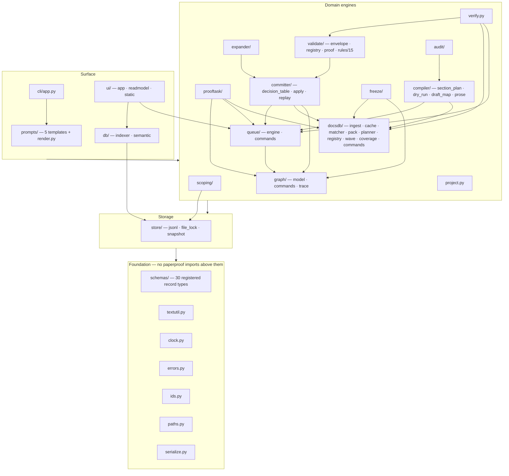

# Structure — `src/paperproof`

Re-derived from code (2026-07-09). 92 Python files, ~14k lines, 408 public
top-level symbols (see `interfaces.md`, gate-verified). Layered: everything
depends downward; the CLI is the only inward boundary; workers touch the tree
only through their one declared output file.

## Module map

| Module | Responsibility (from code) | Depends on (paperproof.*) |
|---|---|---|
| `__init__.py` / `__main__.py` | version pin; `python -m paperproof` → `cli.app.main` | cli.app |
| `clock.py` | injectable RFC3339-UTC clock + actor identity (PAPERPROOF_NOW/ACTOR) | — |
| `errors.py` | DomainError(1) / UsageError(2) / CorruptStateError(3) hierarchy carrying errors/warnings/data | — |
| `ids.py` | deterministic max+1 id allocation (NODE/EDGE/-vN, PT/CTX/DOCSPACK/-rN, generic widths) | — |
| `paths.py` | canonical project tree (DIRS / EMPTY_JSONL / LOCK_FILES) + frozen `Paths` resolver | — |
| `serialize.py` | canonical byte-stable JSON (compact, UTF-8, schema field order) for all state writers | — |
| `textutil.py` | the only tokenizer/matcher: normalize, CJK-aware tokens, word/sentence counts, quote_match, scope_compatible | — |
| `project.py` | `project init` (materialize tree + snapshot GS-000001) / `project status` | store, graph.commands |
| `verify.py` | whole-project invariant sweep → CorruptStateError exit 3 (schema registry, V-PR-12 recompute, queue/commit replay, wave/source/semantic rules, xrefs) | schemas, validate.rules (6 families), committer.decision_table, graph, queue.engine, docsdb.wave, db |
| `schemas/` | 30 pydantic v2 strict record types + REGISTRY, one file per protocol family; pure DTO leaf — zero imports, zero I/O | — |
| `store/` | append-only JSONL primitives (latest-per-id folds), fcntl file locks, snapshot hash+rows | paths, serialize, errors |
| `scoping/` | topic parse (P-rules) → PaperSpec + ProjectContract derive → merge patches → `v_spec` gate → accept | schemas.spec, store, validate, textutil |
| `graph/` | GraphView latest-per-id fold; spine; 1-hop; MSA-1..9; trace chain | store, queue.engine (MSA-6), committer.apply, docsdb.coverage, validate.rules (v_exp/v_sweep), textutil; reads `compiler/dry_runs.jsonl` directly for MSA-8 |
| `expander/` | proposal validation (V-EXP, V-SWEEP-01) → committer.apply_expansion; park/unpark | committer, validate.rules + validate.envelope, graph, store |
| `prooftask/` | frontier scan → immutable PT/CTX/DOCSPACK bundles (-rN) → validate (V-TASK, V-COV-02) → attach | graph, queue.engine, docsdb.coverage+pack, validate.rules, store |
| `validate/` | envelope (Failure→failed_rules/detail), registry (V-* ids), proof.py (`validate result` runtime), rules/ (15 pure rule modules) | schemas, store, queue.engine, committer.decision_table+replay, graph, textutil |
| `committer/` | decision table (pure, shared), apply (serial single writer under `commit/.lock`), replay (V-COMMIT-04) | queue.engine, docsdb (cache/matcher/coverage/planner), graph, store, validate.rules (v_cov, v_node_edge) |
| `docsdb/` | ingest (sole docs writer + V-DR/V-SP battery), cache (fingerprint-only), matcher/pack (keyword + hybrid), planner (deterministic plans), registry (tiers, V-SRC), wave (fan lifecycle + merge + critic), coverage (S4 fold/floors/saturation), commands (CLI bodies) | schemas.docs+search, store, queue.engine, validate.rules (v_dr/v_sp/v_src/v_cov/v_path/v_wave), graph, db.semantic, textutil |
| `queue/` | engine: LEGAL 11-state table, leases + manifests, sweeps, sole queue writer; commands: CLI bodies | store, validate.rules.v_path, graph (blocked semantics), docsdb (queue-list wave grouping) |
| `freeze/` | V-FRZ preconditions (closure active, S4 floor, triangulation, no open work, MSA+verify for spine) → freeze_item + committer batch commit; human-only unfreeze | graph, docsdb.coverage, validate.rules.v_src, committer, verify |
| `compiler/` | section_plan (deterministic buckets), dry_run (5 gap kinds, idempotent items), draft_map (derived), prose (V-PROSE ingest + promote) | graph, queue.engine, docsdb.coverage, store |
| `audit/` | mechanical prose audit (binding/strength/scope/coverage findings) | compiler.draft_map, graph, store |
| `prompts/` | 5 canonical templates (drift-guarded) + render.py (fills, embeds plan/registry/DraftMap, V-SRC-05 gate, retry suffix) | docsdb (registry/planner/wave), queue.engine, graph.model, compiler.draft_map, validate.rules.v_src, db.semantic (advisory) |
| `cli/` | Typer app; EnvelopeGroup = exactly one JSON envelope per command, exit 0/1/2/3; closed command surface | every domain module (thin bodies) |
| `db/` | indexer: derived DuckDB (17 tables + `*_current` views + manifest); semantic: pinned ONNX e5 embeddings, parquet vectors, advisory leads | store, paths, serialize |
| `ui/` | FastAPI read-mostly monitor over db/ (writes: claim/release/db-rebuild only); vendored cytoscape | db, queue.engine, graph, project |

## Boundary notes (cross-module invariants visible only from both sides)

- `queue.engine.commit_item` / `invalidate` / `cancel` / `rebuild` take **no**
  queue lock by design. Their callers: committer.apply (under `commit/.lock`),
  docsdb.ingest (`ingest.py:224,385`), docsdb.wave (`wave.py:317,466,578`),
  compiler.prose (`prose.py:163`), compiler.dry_run (`dry_run.py:155`) and
  prooftask.builder (`builder.py:200,232` — `rebuild`'s ONLY caller). The
  non-committer callers hold no lock; serialization relies on these being
  single-orchestrator CLI paths (the known-deferred commit/queue lock race).
- `paths.EMPTY_JSONL` (17 files) and `verify._JSONL_FILES` (17 files) are two
  hand-maintained copies of the same canonical set (drift-guarded by contract
  test `tests/contract/test_wiring.py`).
- `graph.model` helpers `structural_signature` / `load_tombstones` have no
  in-module callers — their consumers are the Committer's staleness check
  (`committer/apply.py`) and `verify.py` respectively. (`evidence_doc_map` was
  dead since the S4 ledger took over its read and was removed in this rebuild.)
- `compiler.section_plan` buckets five node_types; `alternative` is deliberately
  unbucketed and `compiler.dry_run` refuses an alternative-carrying spine with
  V-CDR-03 (enforced in this rebuild; guarded by
  `tests/contract/test_wiring.py` + `tests/contract/test_v_cdr.py`).
- The decision table (`committer/decision_table.py`) is imported by both the
  Validator (verdict computation) and verify (V-PR-12 recompute) — the one
  deliberately shared pure function.
- `schemas/` is a leaf: it imports nothing from paperproof and performs no I/O;
  every runtime path mentioned in its docstrings is owned by another module.
